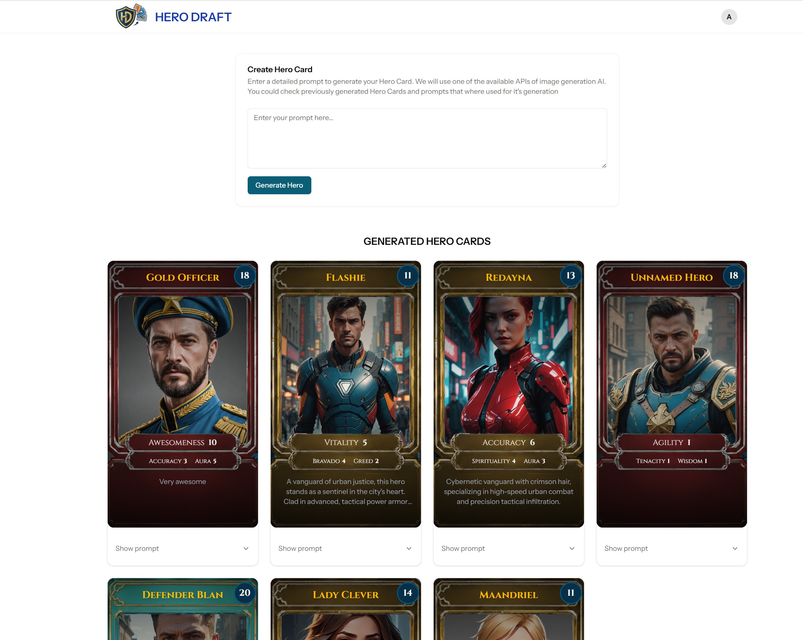
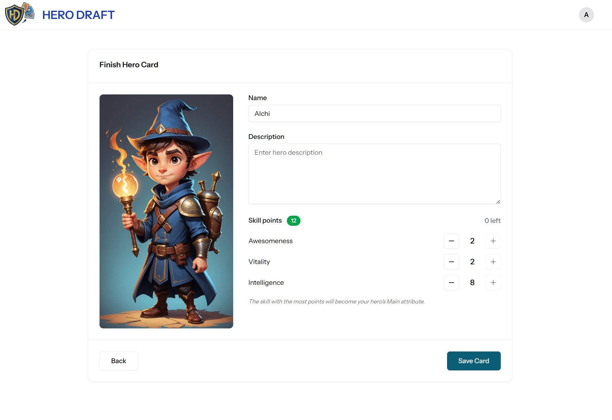
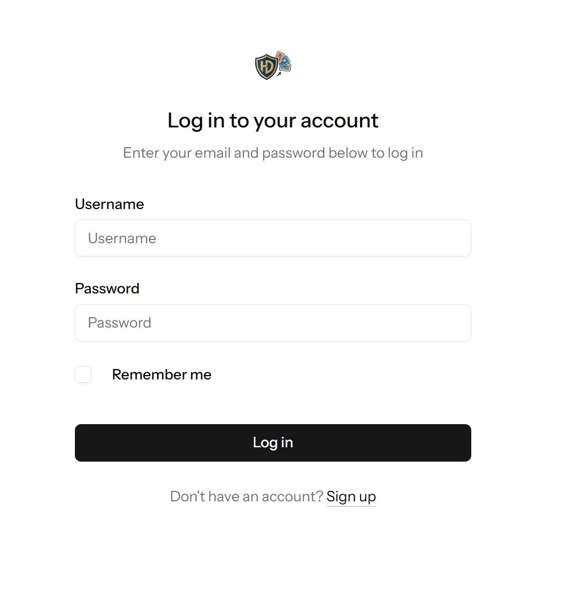

<p align="center">
  
</p>

# Hero Draft 


A simple web application to generate superhero cards using image generation AI tools and manual tuning. Currently supports only **Stability AI** (check [v2beta Docs](https://platform.stability.ai/docs/api-reference))


## Technical stack

- **Laravel 12** with **InertiaJS**
- **Vue 3** with Composition API
- **shadcn** components library
- Tailwind CSS
- AI REST APIs: Stability AI (planned to add more)

## Installation

Install PHP dependencies
```bash
 composer install

```


Install JavaScript dependencies
```bash
pnpm install

```

## Development

Run project

```bash
 composer run dev

```


## Screenshots






